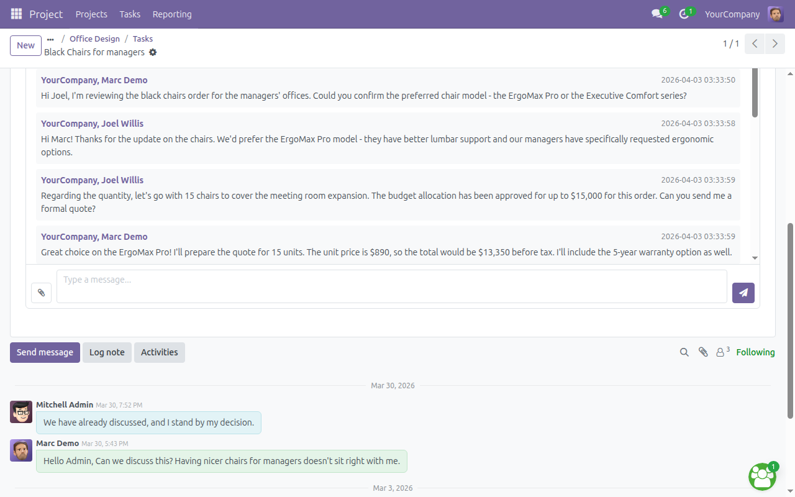
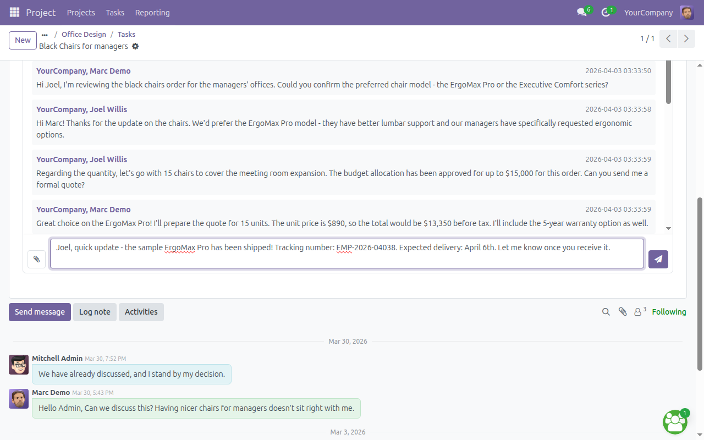
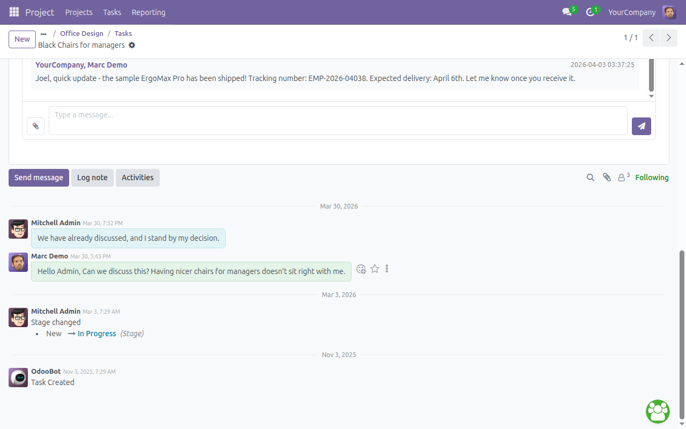
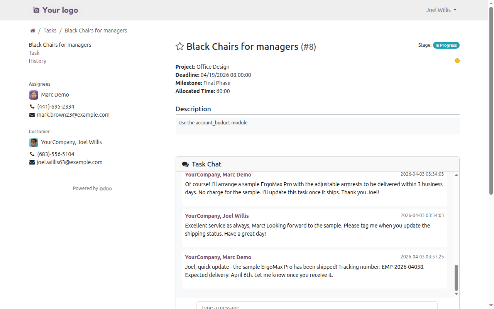
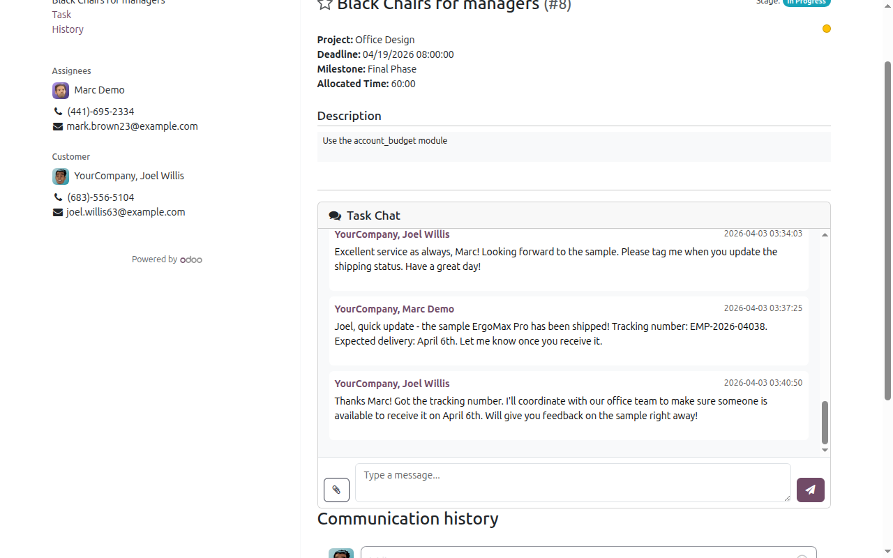
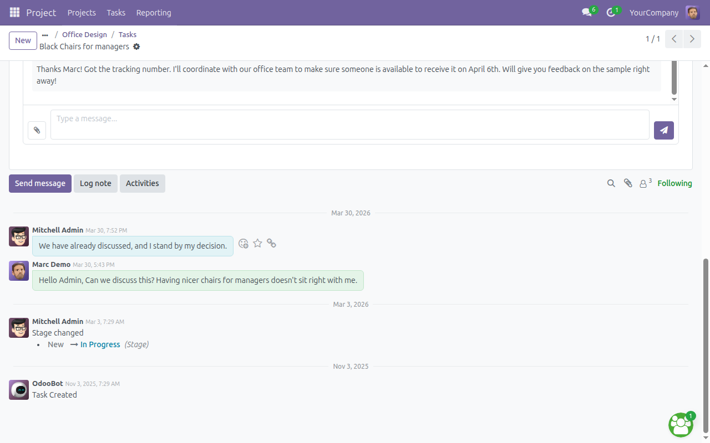
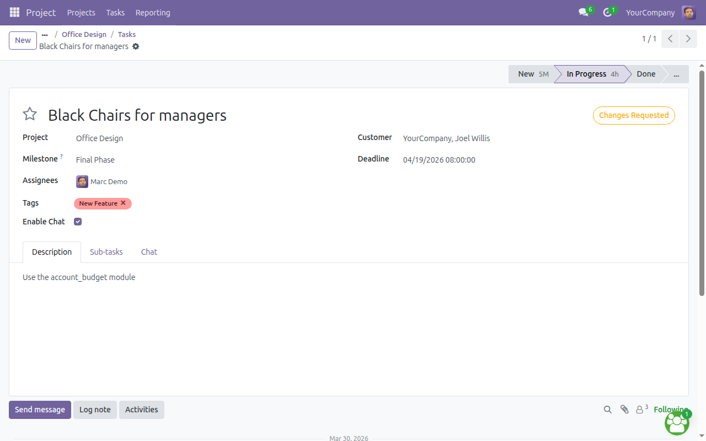
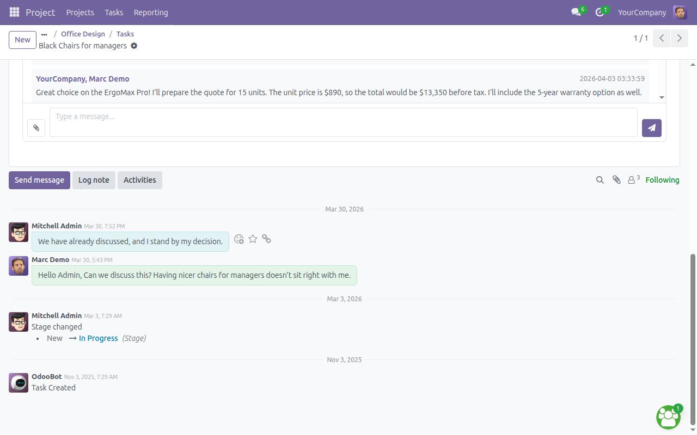

# Project AI Solver

> Real-time task chat for Odoo 18 — enabling direct messaging between internal CS agents and portal customers on project tasks.

**[繁體中文版 README](README.zh-TW.md)**

[](https://www.odoo.com)
[](https://www.gnu.org/licenses/lgpl-3.0)
[](https://github.com/WOOWTECH/Woow_odoo_task_ai_solver)
[]()

---

## Overview

**Project AI Solver** adds a dedicated real-time chat channel to each project task in Odoo 18, allowing internal staff and portal customers to communicate directly within the task context. No more switching between email, chat apps, and the project board.

### Key Highlights

- One-click chat activation per task
- Bidirectional real-time messaging (backend + portal)
- File attachments up to 10 MB with inline image preview
- Cursor-based pagination for large chat histories
- Enterprise-grade security with rate limiting and XSS protection

---

## Screenshots

### Backend: Chat Tab on Task Form

The internal user opens a project task and clicks the **Chat** tab to see the full conversation history. The OWL widget provides a message input field, send button, and file attachment button.



### Backend: Typing and Sending a Message

Internal staff types a message directly in the Chat tab. Pressing Enter or clicking the send button posts the message immediately.



### Backend: Message Sent Successfully

After sending, the message appears instantly in the conversation thread. The backend uses `bus.bus` for real-time push notifications.



### Portal: Customer Viewing Task Chat

Portal customers see the "Task Chat" section on their task detail page (`/my/tasks/<id>`). Messages from internal staff are visible with author names and timestamps.



### Portal: Customer Reply Visible

After the portal customer posts a reply, it appears in the chat history. The portal widget uses smart polling (3s active / 15s idle) for near-real-time updates.



### Backend: Internal Staff Sees Portal Customer's Reply

Back on the internal task form, the staff member can immediately see the portal customer's reply in the Chat tab, confirming full bidirectional communication.



### Task Form: Chat Enabled Checkbox

On any project task, toggle the **Enable Chat** checkbox to auto-create a dedicated `discuss.channel`. Assigned users and the portal customer are automatically added as members.



### Chat History with Pagination

For tasks with extensive conversation history, the "Load older messages" button provides cursor-based pagination, loading previous messages without performance issues.



---

## Architecture

```
┌──────────────────────┐       ┌─────────────────────────┐
│   Internal User      │       │    Portal Customer      │
│   (Backend)          │       │    (Website)            │
└──────────┬───────────┘       └────────────┬────────────┘
           │                                │
  ┌────────▼────────┐            ┌──────────▼──────────┐
  │ TaskChatWidget   │            │ PortalTaskChat      │
  │ (OWL Component)  │            │ (Legacy Widget)     │
  │                  │            │                     │
  │ • bus.bus        │            │ • Smart polling     │
  │   real-time      │            │   3s active/15s idle│
  │ • Load older     │            │ • Exponential       │
  │   messages       │            │   backoff on error  │
  └────────┬─────────┘            └──────────┬──────────┘
           │                                 │
           └──────────┬──────────────────────┘
                      │
          ┌───────────▼────────────┐
          │   Controller (portal.py)│
          │                        │
          │  POST /chat/history    │  ← JSON-RPC, cursor pagination
          │  POST /chat/post       │  ← JSON-RPC, with attachments
          │  POST /chat/upload     │  ← HTTP multipart, max 10MB
          │                        │
          │  ┌──────────────────┐  │
          │  │  Rate Limiter    │  │  ← Per-user, per-endpoint
          │  │  history: 60/60s │  │
          │  │  post:    30/60s │  │
          │  │  upload:  20/60s │  │
          │  └──────────────────┘  │
          │                        │
          │  ┌──────────────────┐  │
          │  │  Access Control  │  │  ← Channel member validation
          │  │  + Savepoint     │  │  ← Race condition handling
          │  └──────────────────┘  │
          └───────────┬────────────┘
                      │
          ┌───────────▼────────────┐
          │  discuss.channel       │
          │  (is_task_chat=True)   │
          │                        │
          │  ┌──────────────────┐  │
          │  │ bus._sendone()   │  │  ← Real-time notification
          │  │ per member       │  │     to all channel members
          │  └──────────────────┘  │
          └───────────┬────────────┘
                      │
          ┌───────────▼────────────┐
          │  mail.message          │
          │  + ir.attachment       │
          │                        │
          │  • html_sanitize()     │  ← XSS prevention
          │  • access_token        │  ← Secure file downloads
          │  • base64 storage      │  ← No filesystem access
          └────────────────────────┘
```

### Data Flow

1. **Enable Chat** — Backend user toggles `chat_enabled` on a task
2. **Channel Created** — System creates a `discuss.channel` with `is_task_chat=True`, adds assigned users + portal customer as members
3. **Send Message** — User posts via `/chat/post` endpoint; message is sanitized by `html_sanitize()` and stored in `mail.message`
4. **Notify** — `bus._sendone()` pushes notification to all channel members
5. **Receive** — Backend widget gets instant bus notification; Portal widget picks up via next poll cycle (3s)

---

## Features

### Core Messaging
- Per-task dedicated chat channel with auto-member assignment
- Rich text message body with HTML sanitization
- File attachments (images, documents) up to 10 MB
- Inline image preview in chat history
- Cursor-based pagination for large conversations

### Real-time Updates
- **Backend**: `bus.bus` push notifications (instant)
- **Portal**: Smart polling with adaptive intervals (3s active → 15s idle)
- Exponential backoff on errors (3s → 6s → 12s → ... → 60s max)
- Graceful error recovery with automatic retry

### Security & Access Control
- Portal users can only access `is_task_chat` channels they are members of
- Automatic member addition via task relationship (customer, follower, or project collaborator)
- Savepoint-based race condition handling for concurrent member additions
- In-memory rate limiting per user per endpoint
- HTML sanitization (server-side `html_sanitize()` + client-side defense-in-depth)
- No raw SQL — all database access through Odoo ORM
- File attachments stored as base64 in database (no filesystem path traversal risk)
- Access tokens for secure file downloads

### UI/UX
- Backend: OWL component in task form Chat tab
- Portal: Legacy widget on `/my/tasks/<id>` page
- Project Sharing: Same OWL widget in shared project views
- "Load older messages" button with loading spinner
- Server-driven upload size display (not hardcoded)

---

## Dependencies

| Module    | Purpose                          |
|-----------|----------------------------------|
| `project` | Project & task models             |
| `mail`    | Messaging, attachments, channels  |
| `bus`     | Real-time push notifications      |

---

## Installation

1. Clone into your Odoo 18 addons path:
   ```bash
   git clone https://github.com/WOOWTECH/Woow_odoo_task_ai_solver.git project_ai_solver
   ```

2. Update module list and install **Project AI Solver** from Apps.

3. Or via CLI:
   ```bash
   odoo -d <dbname> -i project_ai_solver --stop-after-init
   ```

---

## Usage

1. Open a project task in the backend
2. Check the **Enable Chat** checkbox
3. A chat channel is auto-created with assigned users and the portal customer
4. Click the **Chat** tab to start messaging
5. Portal users see the chat on their task page (`/my/tasks/<id>`) and in Project Sharing

---

## File Structure

```
project_ai_solver/
├── __manifest__.py                    # Module metadata & asset bundles (v18.0.1.1.0)
├── __init__.py
├── README.md                          # English documentation
├── README.zh-TW.md                    # Traditional Chinese documentation
│
├── controllers/
│   └── portal.py                      # 3 API endpoints + rate limiter + access control
│
├── models/
│   ├── project_task.py                # chat_enabled, channel_id, auto-channel creation
│   └── discuss_channel.py             # is_task_chat field, bus notification on message_post
│
├── security/
│   ├── ir.model.access.csv            # Portal ACL: read channels, read+create messages
│   └── security.xml                   # Record rules: portal isolation + is_task_chat guard
│
├── static/
│   ├── description/
│   │   └── screenshots/               # 10 annotated screenshots for documentation
│   └── src/
│       ├── components/task_chat/
│       │   ├── task_chat.js            # OWL widget (backend + project sharing)
│       │   ├── task_chat.xml           # OWL template with pagination
│       │   └── task_chat.scss          # Styles
│       └── portal/
│           └── portal_chat.js          # Legacy widget with smart polling + exponential backoff
│
├── templates/
│   └── portal_task_chat.xml            # Portal page template (inherits portal_my_task)
│
├── views/
│   ├── project_task_views.xml          # Backend form: Chat tab + Enable Chat checkbox
│   └── project_sharing_views.xml       # Project Sharing form: Chat tab
│
├── tests/
│   └── test_task_channel.py            # Unit tests (11 test cases)
├── test_e2e_chat.py                    # E2E integration tests (14 tests)
├── test_comprehensive_v2.py            # Comprehensive test suite (50+ tests, 5 rounds)
├── test_commercial_v3.py               # Commercial enterprise tests (80+ tests, 6 rounds)
│
└── docs/plans/
    ├── 2025-02-07-task-chat-enhancements-prd.md
    ├── 2026-04-03-comprehensive-repair-upgrade.md
    └── 2026-04-03-v1.1.0-prd.md
```

---

## API Endpoints

| Endpoint | Method | Auth | Rate Limit | Description |
|----------|--------|------|-----------|-------------|
| `/project_ai_solver/chat/history` | POST (JSON) | User | 60 req/60s | Fetch messages with cursor-based pagination |
| `/project_ai_solver/chat/post` | POST (JSON) | User | 30 req/60s | Post message with optional attachment IDs |
| `/project_ai_solver/chat/upload` | POST (multipart) | User | 20 req/60s | Upload file (max 10 MB), returns attachment metadata |

### Request/Response Examples

**POST /chat/history**
```json
// Request
{"jsonrpc": "2.0", "method": "call", "params": {
    "channel_id": 80,
    "limit": 20,
    "before_date": "2026-04-03 10:00:00"
}}

// Response
{"result": {
    "messages": [
        {
            "id": 123,
            "body": "<p>Hello! The sample has been shipped.</p>",
            "author_id": [6, "Marc Demo"],
            "date": "2026-04-03 03:33:59",
            "attachments": [
                {"id": 45, "name": "quote.pdf", "mimetype": "application/pdf",
                 "file_size": 52480, "access_token": "abc123", "is_image": false}
            ]
        }
    ],
    "has_more": true,
    "config": {"max_upload_size": 10485760}
}}
```

**POST /chat/post**
```json
// Request
{"jsonrpc": "2.0", "method": "call", "params": {
    "channel_id": 80,
    "message_body": "The chairs have been delivered!",
    "attachment_ids": [45, 46]
}}

// Response
{"result": {"success": true}}
```

---

## Security

### Threat Model & Mitigations

| Threat | Mitigation | Tested |
|--------|-----------|--------|
| XSS (15 vectors) | Server-side `html_sanitize()` + client-side script stripping | 15/15 blocked |
| SQL Injection | Odoo ORM parameterized queries (no raw SQL) | 4/4 blocked |
| Path Traversal | Attachments stored as base64 in DB, no filesystem access | Verified |
| Rate Abuse | Per-user per-endpoint in-memory rate limiter | 30/60/20 limits verified |
| Unauthorized Access | Channel member validation + portal record rules | Cross-user denial verified |
| Race Conditions | Savepoint-based concurrent member addition | Concurrent threads verified |
| File Size Abuse | 10 MB hard limit with precise boundary enforcement | 10MB+1 byte rejected |

### Security Architecture

- **Record Rules**: Portal users can only read `discuss.channel` records where `is_task_chat=True` AND they are channel members
- **ACL**: Portal group has read-only access to channels, read+create for messages
- **No raw SQL**: All previous `cr.execute()` calls replaced with ORM methods
- **HTML Sanitization**: Odoo's `html_sanitize()` (powered by lxml) neutralizes all dangerous HTML. `<script>` tags are removed entirely; other dangerous elements are HTML-entity-encoded
- **Access Tokens**: File downloads require valid `access_token` query parameter

---

## Testing

### Test Suites

| Suite | Tests | Coverage |
|-------|-------|----------|
| `test_task_channel.py` | 11 | Channel creation, members, idempotency, access control |
| `test_e2e_chat.py` | 14 | End-to-end: model fields, views, messaging, attachments |
| `test_comprehensive_v2.py` | 50+ | 5 rounds: auth, pagination, uploads, templates, bus |
| `test_commercial_v3.py` | 80+ | 6 rounds: security, concurrency, data integrity, performance, lifecycle, compliance |
| Playwright edge cases | 34 | Rate limits, 10MB boundary, XSS vectors, SQL injection, Unicode |
| **Total** | **140+** | |

### Running Tests

```bash
# Unit tests (inside Odoo)
odoo -d <dbname> --test-enable --test-tags project_ai_solver --stop-after-init

# Comprehensive test suite (external, requires running Odoo instance)
python3 test_comprehensive_v2.py

# Commercial enterprise test suite
python3 test_commercial_v3.py
# Expected: 106/106 passing
```

### Edge Case Test Results (v18.0.1.1.0)

| Category | Tests | Pass | Status |
|----------|-------|------|--------|
| Rate Limiting Boundary | 3 | 3 | All limits enforced precisely |
| File Upload Boundary | 8 | 8 | 10MB boundary exact, Unicode/long filenames OK |
| Concurrency | 4 | 4 | 10 concurrent POSTs, ordering preserved |
| XSS Security (15 vectors) | 3 | 3 | All payloads sanitized or blocked |
| Error Handling | 16 | 16 | Empty/long messages, invalid IDs, SQL injection |

---

## Changelog

### v18.0.1.1.0 (2026-04-03)

- **Security**: Add per-user per-endpoint rate limiting (60/30/20 req per 60s)
- **Security**: Replace raw SQL with ORM for attachment creation
- **Security**: Add `is_task_chat` field for tighter portal record rules
- **Security**: Client-side XSS defense-in-depth (script stripping, HTML escaping)
- **Fix**: Savepoint-based race condition handling for concurrent member additions
- **Fix**: Timer leak on component unmount (`onWillUnmount` cleanup)
- **Fix**: Replace `setInterval` with `setTimeout` chaining to prevent poll pile-up
- **Fix**: Raise `UserError` on empty channel creation instead of silent warning
- **Feature**: Cursor-based pagination with "Load older messages" button
- **Feature**: Exponential backoff on portal polling errors (3s → 60s)
- **Feature**: Server-driven upload size config
- **Tests**: 140+ test cases across 5 test suites

### v18.0.1.0.0

- Initial release with per-task chat, backend OWL widget, portal widget, file attachments

---

## License

LGPL-3
